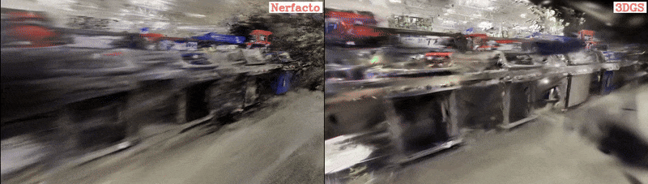

# Difix3D+

**Difix3D+: Improving 3D Reconstructions with Single-Step Diffusion Models**  
[Jay Zhangjie Wu*](https://zhangjiewu.github.io/), [Yuxuan Zhang*](https://scholar.google.com/citations?user=Jt5VvNgAAAAJ&hl=en), [Haithem Turki](https://haithemturki.com/), [Xuanchi Ren](https://xuanchiren.com/), [Jun Gao](https://www.cs.toronto.edu/~jungao/),  
[Mike Zheng Shou](https://sites.google.com/view/showlab/home?authuser=0), [Sanja Fidler](https://www.cs.utoronto.ca/~fidler/), [Zan Gojcic†](https://zgojcic.github.io/), [Huan Ling†](https://www.cs.toronto.edu/~linghuan/) _(*/† equal contribution/advising)_  
CVPR 2025 (Oral)  
[Project Page](https://research.nvidia.com/labs/toronto-ai/difix3d/) | [Paper](https://arxiv.org/abs/2503.01774)

<div align="center">
  
</div>

## News

* [25/04/2025] We will release the code and models soon. Stay tuned!

## Citation

```bibtex
@inproceedings{wu2025difix3d,
  title={Difix3D+: Improving 3D Reconstructions with Single-Step Diffusion Models},
  author={Wu, Jay Zhangjie and Zhang, Yuxuan and Turki, Haithem and Ren, Xuanchi and Gao, Jun and Shou, Mike Zheng and Fidler, Sanja and Gojcic, Zan and Ling, Huan},
  booktitle={Proceedings of the IEEE/CVF Conference on Computer Vision and Pattern Recognition},
  year={2025}
}
```


